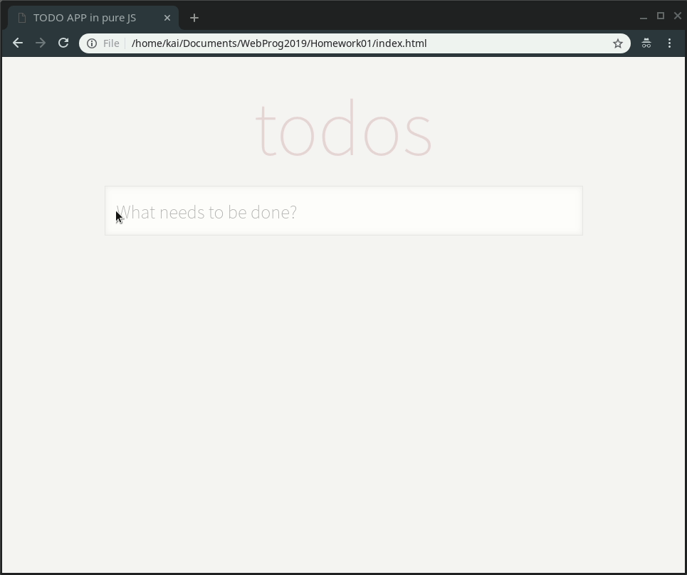

# Homework01 -- TODO List in pure JS

## Demo

## functionalities

+ [x] 可建立數個 TodoItems
+ [x] 可新增刪除任意 TodoItem
+ [x] 可勾選已完成的 TodoItem
+ [x] 在畫面上顯示已完成的 TodoItems 的不同
+ [x] 統計並顯示未完成的 TodoItem 數量
+ [x] filter 已完成/未完成項目
+ [x] 一鍵刪除所有已完成項目

## How to use

open index.html with browser