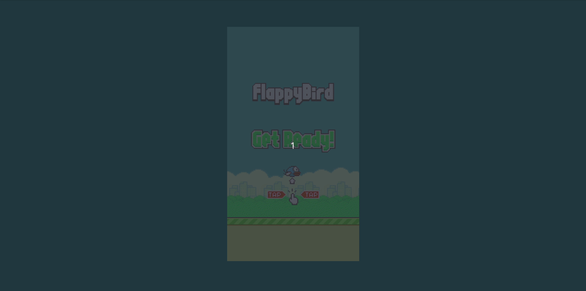

# Homework02 -- Flappy Bird in p5.js

## Demo

## functionalities

+ [x] 鳥可以受「空白鍵」控制來飛
+ [x] 可以隨著動作發出聲音
+ [x] 鳥的顏色、背景隨機出現
+ [x] 可以判斷鳥是否有撞到柱子、天空、地板
+ [x] 可計分、顯示「Game Over」、重玩

## How to use

- run "bash run.sh" to start the python server.
- navigate to "localhost" in a browser.